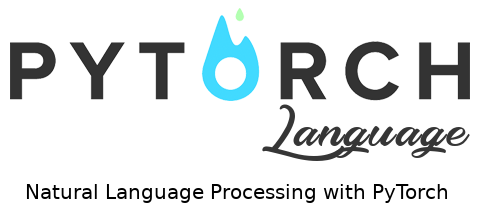

<p align="center"></p>

--------------------------------------------------------------------------------

[](https://gitter.im/TorchLanguage/Lobby?utm_source=badge&utm_medium=badge&utm_campaign=pr-badge&utm_content=badge)
TorchLanguage is the equivalent of TorchVision for Natural Language Processing. It gives you access to text transformers (tokens, index, n-grams, etc) and data sets.

<a href="https://twitter.com/intent/tweet?text=TorchLanguage%20is%20the%20equivalent%20of%20TorchVision%20for%20Natural%20Language%20Processing.%20It%20gives%20you%20access%20to%20text%20transformers%20and%20datasets.&url=https://github.com/nschaetti/TorchLanguage&hashtags=pytorch,nlp,research">
    
  </a>

Join our community to create datasets and deep-learning models! Chat with us on [Gitter](https://gitter.im/TorchLanguage/Lobby) and join the [Google Group](https://groups.google.com/forum/#!forum/torchlanguage/) to collaborate with us.


[](https://codecov.io/gh/nschaetti/TorchLanguage)
[](http://torchlanguage.readthedocs.io/en/latest/?badge=latest&style=flat-square)
[](https://travis-ci.org/nschaetti/TorchLanguage)

This repository consists of:

* torchlanguage.datasets : Pre-built datasets for common NLP tasks
* torchlanguage.models : Generic pretrained models for common NLP tasks
* torchlanguage.transforms : Common transformation for text
* torchlanguage.utils : Tools, functions and measures for NLP

Installation
============

Make sure you have Python 2.7 or 3.5+ and PyTorch 0.2.0 or newer. You can then install torchlanguage using pip::

    pip install TorchLanguage

Optional requirements
---------------------

If you want to use English tokenizer from `SpaCy <http://spacy.io/>`_, you need to install SpaCy and download its English model::

    pip install spacy
    python -m spacy download en

Text transformation pipeline
============================

The following transformation are available :

* Character
* Character2Gram
* Character3Gram
* Compose
* DropOut
* Embedding
* FunctionWord
* GensimModel
* GloveVector
* HorizontalStack
* MaxIndex
* PartOfSpeech
* RandomSamples
* RemoveCharacter
* RemoveLines
* RemoveRegex
* Tag
* ToFrequencyVector
* ToIndex
* Token
* ToLength
* ToLower
* ToNGram
* ToOneHot
* ToUpper
* Transformer
* VerticalStack

Data
====

The data module provides the following:

* Ability to download and load a corpus from a directory. The file must be name Class_Title.txt:

```python
dataset = torchlanguage.datasets.FileDirectory(
    root='./data',
    download=True,
    download_url="http://urltozip/file.zip",
    transform=transformer
   )
```

* Wrapper for dataset splits (train, validation) and cross-validation:

```python
cross_val_dataset = {'train': torchlanguage.utils.CrossValidation(dataset, k=k),
    'test': torchlanguage.utils.CrossValidation(dataset, k=k, train=False)}
for k in range(k):
    for data in cross_val_dataset['train']:
        inputs, label = data
    # end for
    for data in cross_val_dataset['test']:
        inputs, label = data
    # end for
    cross_val_dataset['train'].next_fold()
    cross_val_dataset['test'].next_fold()
# end for
```

Datasets
========

The datasets module currently contains:

* FileDirectory: Load a corpus from a directory
* ReutersC50Dataset: The Reuters C50 dataset for authorship attribution
* SFGram: A set of science-fiction magazine with five authors.

Others are planned or a work in progress:

* Traduction
* Question answering

See the ``examples`` directory for examples of dataset usage.

## Related Work

### [echotorch](https://github.com/nschaetti/echotorch)

EchoTorch is a Python framework to easily implement Reservoir Computing models with pyTorch.

## Authors

* [Nils Schaetti](https://github.com/nschaetti/) — Developer

## Citing

If you find TorchLanguage useful for an academic publication, then please use the following BibTeX to cite it:

```
@misc{torchlanguage,
  author = {Schaetti, Nils},
  title = {TorchLanguage: Natural Language Processing with pyTorch},
  year = {2018},
  publisher = {GitHub},
  journal = {GitHub repository},
  howpublished = {\url{https://github.com/nschaetti/TorchLanguage}},
}
```